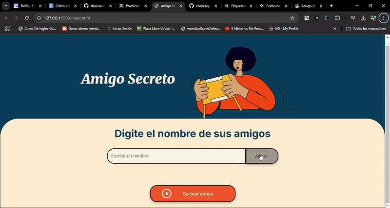

# challenge-amigo-secreto 
Challenge 1: Lógica de programación con JavaScript para el curso ONE (Oracle Next Education) en Alura

<h2>Descripción de su proyecto: </h2>

Este es un proyecto del curso ONE (Oracle Next Education) impartido en la plataforma Alura. El proyecto corresponde al primer challenge logica de programacion y se basa en capturar una lista de nombres de amigos y luego sortear, de forma aleatoria, el nombre de un amigo de la lista, quien será seleccionado como el "amigo secreto".

<h3>Funcionalidades:</h3>
El proyecto incluye las siguientes funciones:

<strong>agregarAmigo():</strong>
Esta función captura los nombres introducidos en el campo input del HTML y los almacena en una lista, pero antes valida si el dato introducido es válido.

<strong>listarNombres():</strong>
Recorre la lista y muestra los nombres en el DOM cada vez que se agrega un nuevo nombre a la lista.

<strong>sortearAmigo():</strong>
Recorre la lista y selecciona un nombre de forma aleatoria, quien será nombrado como el "amigo secreto".

Por otra parte, también tengo un fragmento de código que me sirve para saber si se presiona la tecla ENTER mientras se escribe el nombre de un amigo, de manera que llame a la función </strong>agregarAmigo()</strong>. Hice esto porque considero tedioso que solo se pueda agregar un nombre si se presiona el botón correspondiente.

De momento, el archivo app.js solo tiene dos variables globales:

<strong>listaNombreAmigos = [];</strong> → Es de tipo lista o array y se utiliza para almacenar los nombres.
<strong>lista = document.getElementById('listaAmigos');</strong> → Es un elemento del DOM que utilizo para almacenar la lista <ul>.
<h3>Cómo pueden usarlo los usuarios:</h3>
El uso de esta app es muy simple: basta con colocar nombres en el campo input, agregarlos y, cuando ya no desee agregar más nombres, simplemente debe presionar el botón "Sortear Amigo".

<h3>Dónde los usuarios pueden encontrar ayuda sobre su proyecto:</h3>
Pueden encontrar ayuda en mi repositorio de GitHub:
https://github.com/HectorGary/challenge-amigo-secreto.git

<h3>Autor del proyecto:</h3>
/**
 * <strong>Autor:</strong> Hector Gary Moquete Alcantara
 * <strong>Fecha:</strong> 02-02-2025
 */